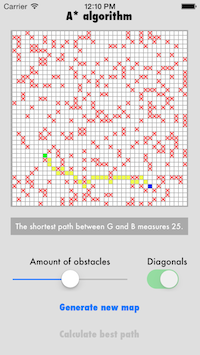
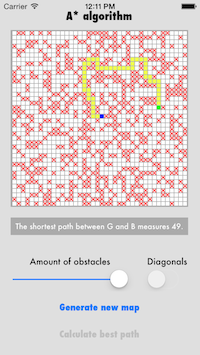
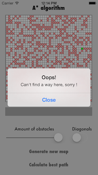

A-Star-algorithm-for-iOS
========================

A* search algorithm implementation for iOS.

Made for iPhone 5 / iOS 6, fully working in iOS 7.

Objectives
---------------------

Implementation of A* search algorithm.

School project made by [William Klein](http://www.williamklein.name "William Klein") @[ITESCIA](http://www.itescia.fr/ "ITESCIA") for [M. CAZENAVE](https://www.linkedin.com/profile/view?id=52600480&locale=fr_FR&trk=tyah&trkInfo=tarId%3A1395744492492%2Ctas%3Acazenave%2Cidx%3A1-1-1 "ITESCIA").

Credit: [Wikimedia A* search algorithm](http://en.wikipedia.org/wiki/A*_algorithm "Wikimedia A* search algorithm")

Screenshots
---------------------

Licence
----------------------
Apache License Version 2.0